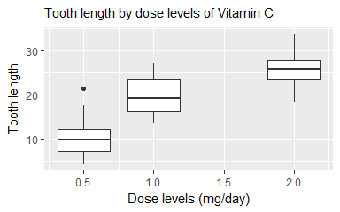

# Analysis of the tooth growth of guinea pigs in response on vitamin C consumption


###_Vadim K._ 
####_2017-01-08_

## Overview
In this project we investigate the ToothGrowth dataset which contains data of the effect of vitamin C on tooth growth in guinea pigs. Effect is measured on 60 pigs which were receiving one of three dose levels of Vitamin C (0.5, 1, and 2 mg/day) by one of two delivery methods (orange juice or ascorbic acid (a form of vitamin C and coded as VC).

We will run several T-tests to support the conclusions that orange juice is more efficient in dose levels of 0.5 and 1 mg/day; and also that globally the effect on growth is generally higher with higher doses of vitamin C.

##Loading data

We load data from package 'datasets'

```r
library(datasets)
data(ToothGrowth)
```

###Basic exploratory analysis
Let's take a quick look at the beginning and the end of dataset

```r
head(ToothGrowth, n=3) ; tail(ToothGrowth, n=3)
```

```
##    len supp dose
## 1  4.2   VC  0.5
## 2 11.5   VC  0.5
## 3  7.3   VC  0.5
```

```
##     len supp dose
## 58 27.3   OJ    2
## 59 29.4   OJ    2
## 60 23.0   OJ    2
```

and it's global structure

```r
str(ToothGrowth)
```

```
## 'data.frame':	60 obs. of  3 variables:
##  $ len : num  4.2 11.5 7.3 5.8 6.4 10 11.2 11.2 5.2 7 ...
##  $ supp: Factor w/ 2 levels "OJ","VC": 2 2 2 2 2 2 2 2 2 2 ...
##  $ dose: num  0.5 0.5 0.5 0.5 0.5 0.5 0.5 0.5 0.5 0.5 ...
```

##Analysis

###Basic summary of the data
Here is the summary of the dataset

```r
summary(ToothGrowth)
```

```
##       len        supp         dose      
##  Min.   : 4.20   OJ:30   Min.   :0.500  
##  1st Qu.:13.07   VC:30   1st Qu.:0.500  
##  Median :19.25           Median :1.000  
##  Mean   :18.81           Mean   :1.167  
##  3rd Qu.:25.27           3rd Qu.:2.000  
##  Max.   :33.90           Max.   :2.000
```

Now let's plot the data separated by different delivery method and dose levels


```r
print(g1)
```

<!-- -->

Also let's look at the global picture by dose levels


```r
print(g2)
```

<!-- -->

###Hypothesis tests
As we see on Plot 1 delivery method OJ (Orange juice) looks more efficient than ascorbic acid but only on dose levels of 0.5 and 1.0 mg/day, while on 2.0 mg/day it's note quite clear.  
We will test these hypothesis by running 3 T-tests on pairs of delivery methods within same dose level.  

We assume that the observations are not paired and their variances are not equal.  

The 1st test was done at dose level of 0.5 mg/day (see **Appendix 1** for full test result)  
_Confidence interval doesn't contain 0 and P-value is very low (0.003) so the test is statistically significant and we reject the null hypothesis that means are equal and accept the alternative one._  

The 2nd test at dose level of 1.0 mg/day (see **Appendix 1** for full test result)  
_Confidence interval doesn't contain 0 and P-value is very low (0.0005) so the test is statistically significant and we reject the null hypothesis that means are equal and accept the alternative one._  

The 3rd test at dose level of 2.0 mg/day (see **Appendix 1** for full test result)  
_P-value is very high (0.96) and confidence interval contains 0 - we fail to reject null hypothesis - difference between OJ and VC is not proven on 2.0 mg/day dose level._ 

The last T-test we'll run between 2 global subsets of minimum and maximum dose levels (i.e. 0.5 and 2.0 mg/day) to check the hypothesis that in general the increase of dose leads to increase in tooth growth (see **Appendix 1** for full test result)  
_Confidence interval doesn't contain 0 and P-value is very low (2.2e-14) so the test is statistically significant and our alternative hypothesis is proven._

##Results
###Conclusions

- Vitamin C has positive effect on tooth growth of guinea pigs. Effect on growth is generally higher with higher doses of vitamin C (between 0.5, 1.0 and 2.0 mg/day);
- Orange juice is more efficient than ascorbic acid in dose levels of 0.5 and 1 mg/day and there is no difference in delivery methods for 2.0 mg/day.  

Above conclusions are based on the below assumptions:

###Assumptions
- Observations in dataset are not paired;
- Their variances are not equal 

\pagebreak

#APPENDIX 1
Here are the detailed results of t-tests and the full code to run the analysis


```r
#Plot 1
library(ggplot2)
g1 <- ggplot(ToothGrowth, aes(x=supp, y=len)) + 
      geom_boxplot(aes(fill=supp)) +
      facet_grid(.~dose) + guides(fill=FALSE) +
      labs(list(title = "Guinea Pigs Tooth length by dose levels \n of Vitamin C and different delivery methods", 
                x = "Delivery Method",
                y = "Tooth length")) +
      theme(plot.title = element_text(size=11),
            axis.title.x = element_text(size=11),
            axis.title.y = element_text(size=11))
```


```r
#Plot 2
g2 <- ggplot(ToothGrowth, aes(x=dose, y=len, group=dose)) + geom_boxplot() +
      labs(list(title = "Guinea Pigs Tooth length by dose levels of Vitamin C", 
                x = "Dose levels (mg/day)",
                y = "Tooth length"))
```


```r
#subsetting data for 1st set of T-tests
OJ_05 <- ToothGrowth$len[ToothGrowth$supp == "OJ" & ToothGrowth$dose == 0.5]
OJ_10 <- ToothGrowth$len[ToothGrowth$supp == "OJ" & ToothGrowth$dose == 1.0]
OJ_20 <- ToothGrowth$len[ToothGrowth$supp == "OJ" & ToothGrowth$dose == 2.0]

VC_05 <- ToothGrowth$len[ToothGrowth$supp == "VC" & ToothGrowth$dose == 0.5]
VC_10 <- ToothGrowth$len[ToothGrowth$supp == "VC" & ToothGrowth$dose == 1.0]
VC_20 <- ToothGrowth$len[ToothGrowth$supp == "VC" & ToothGrowth$dose == 2.0]
```


```r
#1st set of T-tests
t.test(OJ_05, VC_05, paired = FALSE, var.equal = FALSE, altern = "greater")
```

```
## 
## 	Welch Two Sample t-test
## 
## data:  OJ_05 and VC_05
## t = 3.1697, df = 14.969, p-value = 0.003179
## alternative hypothesis: true difference in means is greater than 0
## 95 percent confidence interval:
##  2.34604     Inf
## sample estimates:
## mean of x mean of y 
##     13.23      7.98
```

```r
t.test(OJ_10, VC_10, paired = FALSE, var.equal = FALSE, altern = "greater")
```

```
## 
## 	Welch Two Sample t-test
## 
## data:  OJ_10 and VC_10
## t = 4.0328, df = 15.358, p-value = 0.0005192
## alternative hypothesis: true difference in means is greater than 0
## 95 percent confidence interval:
##  3.356158      Inf
## sample estimates:
## mean of x mean of y 
##     22.70     16.77
```

```r
t.test(OJ_20, VC_20, paired = FALSE, var.equal = FALSE, altern = "two.sided")
```

```
## 
## 	Welch Two Sample t-test
## 
## data:  OJ_20 and VC_20
## t = -0.046136, df = 14.04, p-value = 0.9639
## alternative hypothesis: true difference in means is not equal to 0
## 95 percent confidence interval:
##  -3.79807  3.63807
## sample estimates:
## mean of x mean of y 
##     26.06     26.14
```


```r
#subsetting data for 2nd set of T-tests
all_05 <- ToothGrowth$len[ToothGrowth$dose == 0.5]
all_10 <- ToothGrowth$len[ToothGrowth$dose == 1.0]
all_20 <- ToothGrowth$len[ToothGrowth$dose == 2.0]
```


```r
#2nd set of T-tests
t.test(all_20, all_05, paired = FALSE, var.equal = FALSE, altern = "greater")
```

```
## 
## 	Welch Two Sample t-test
## 
## data:  all_20 and all_05
## t = 11.799, df = 36.883, p-value = 2.199e-14
## alternative hypothesis: true difference in means is greater than 0
## 95 percent confidence interval:
##  13.27926      Inf
## sample estimates:
## mean of x mean of y 
##    26.100    10.605
```
